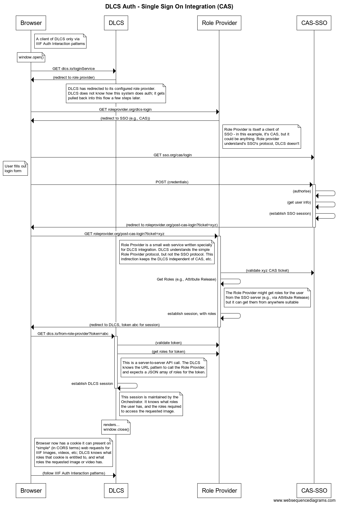

# Access Control

## Context

This document is about access control for assets and services for those assets, not for the APIs of the DLCS itself.
This means the IIIF Auth API, in its current and future versions, rather than the REST HTTP API used to create and administer the assets. The IIFI API is comsumed (indirectly) by end-users, via IIIF Clients in the browser. The REST API is consumed by systems integration workflows, tools, and possibly browser-based content creation tools.

## Providing the IIIF Auth API

The DLCS is the system serving the assets, therefore it must establish a session (e.g., by using cookies, or other means) for the user.

When assets are registered, they are given a set of *roles*. These are usually opaque URIs as far as the DLCS is concerned. An open, public asset has no roles, anyone can see it. An asset might have many roles; if the user has any of them, they can see the image.

The DLCS can enforce the IIIF *Clickthrough* pattern without further integration, as it does not need to know the identity of the user. It just needs to establish a session for them, and ensure they have accepted any clickthrough terms.

All other kinds of auth require the DLCS to know what roles the user has, and to establish a session for them so that it can authorise their access to images based on their known roles - if the image they are trying to access has the role, then the user's session needs to have the role.

The system that knows who the user is, and can tell the DLCS what roles the user has, might be an external single-sign-on system. The DLCS implements a very simple protocol for *role acquisition* (it still doesn't need to actually know who the user is, unlike many other single-sign-on requirements).

This protocol is not dependent on the IIIF Auth API, and the DLCS can accomodate future changes in that spec, or support the provision of alternative auth arrangements, using the role-acquisition integration described here.

## The Role Provider

The Role Provider is the bridge between the DLCS and one or more sources of user information, authentication, and authorisation. The DLCS arranges for the user to establish a session with the Role Provider, a web application. The Role Provider can tell the DLCS what roles that user has. 

It doesn't matter what those roles mean, or how the Role Provider decided they were appropriate for the user. They might be fixed - this user is faculty, so can see images that require the "faculty" role. Or it might be transient - this user is in the "temporary-lesson" role for two hours only. The DLCS doesn't need to know any of these details, they are delegated to the Role Provider.

The Role Provider doesn't authorise requests. It gives the DLCS the information it needs to authorise requests. The DLCS talks to the role provider to establish a session, but thereafter can authorise requests autonomously, in the Orchestrator module, for the lifetime of the DLCS session. This is essential for performance, especially for tile requests.

(TODO) Role provider configuration - by space? By individual image? By customer?

In this first example, the Role Provider application presents the login form, takes the user's credentials, and queries some store of user data with those credentials. This is a simpler flow, but may not be how a large institutional Single Sign On (SSO) system works.

In the above sequence, the Role Provider is able to authenticate a user, and find out their permissions. This might involve looking up user records in a database, but it could be other mechanisms - e.g., IP address, filling out a survey, or indeed anything. The Role Provider is a web application that maintains a session (probably using cookies). In the simple case, the user sees a login page rendered by the Role Provider application.

(Note for clarity - at Wellcome, the Role Provider application is the DDS).

This scenario is flexible for many scenarios, but an extra layer of indirection is required for a typical institutional SSO system, where we can't expect the SSO system itself to also implement the DLCS integration. 

The second flow assumes that the role provider application is a client service of an insitutional single sign on system (just as the library catalogue, or e-Learning platforms, might be). In this case the Role Provider doesn't present a login UI, but it still renders HTTP responses that redirect or close windows. It's a stepping stone to the single sign on system's login screen, and is the return location after the user logs in there. The DLCS still talks only to the Role Provider, but the Role Provider delegates auth to SSO.

In this example the CAS protocol is shown, but the indirection here means that any SSO mechanism can work.

## TODO

### Session identity

Although the DLCS doesn't need to know who the user is to enforce access control (just their roles), it might still be useful to use the identity token in the user's session. This allows the DLCS to log access, and possibly later enforce quotas. The data could be reconciled by reporting outside of the DLCS. It would up to external systems to keep track of the association between a user and the tokens issues on their behalf.